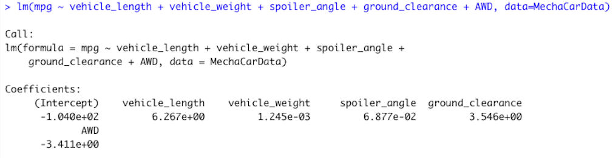
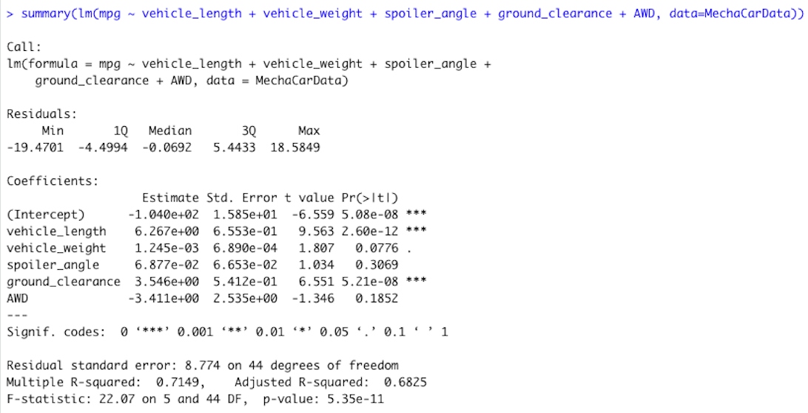
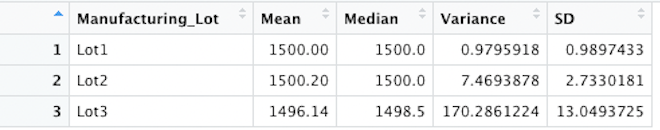
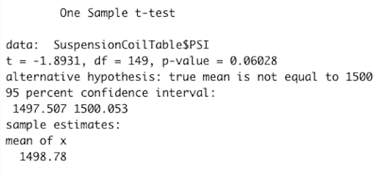
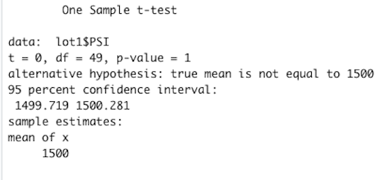
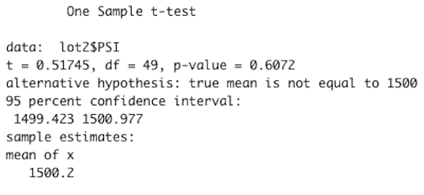
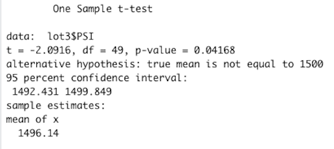

# I Want My MPG

## Linear Regression to Predict MPG
I performed a multiple linear regression on the depedent variable of miles per gallon (mpg) based on the independent variables of vehicle length, vehicle weight, spoiler angle, ground clearance and drivetrain (AWD):

This analysis calculated the intercept and the coefficients of each variable in the linear model as shown above and revealed the following summary metrics:

The vehicle_length and the ground_clearance are the two variables that provided non-random amounts of variance to the miles per gallon values, which can be seen in their very low p-values of 2.60e-12 and 5.21e-08, respectively. Therefore, vehicle length and ground clearance seem to have significant impact on the miles per gallon of the vehicles. Also, the slope of the linear model should not be considered to have a slope of 0 since the p-value of the linear model is 5.35e-11. This p-value allows me to reject the null hypothesis that the slope is 0 since the p-value is so low. Lastly, the linear model does a decent job of predicting the MechaCar prototypes since it has an r-squared value of 0.7149. However, having a p-value of 5.08e-08, the intercept is statisclly significant and may mean that there are additional independent variables not included in the model that contribute to the variability of the miles per gallon variable. 

---
## Summary Statistics on Suspension Coils
Calculating the summary statistics for the suspension coil's PSI variable for the complete dataset produced the following numbers:

Grouping by the three manufacturing lots allowed me to determine the summary statistics for each group as well:

These summary statistics are important since the design specifications for the MechaCar suspension coils requires that the variance not exceed 100 pounds per square inch. The manufacturing lots in total meet this specificaion since the variance is 62.29356. Individually, manufacturing lots 1 and 2 meet the design specifications with variances of 0.9795918 and 7.4693878, respectively; however, manufacturing lot 3 dramatically exceeds the specification with a variance of 170.2861224.

---
## T-Tests on Suspension Coils
First, I performed a t-test to determine if the mean PSI for all the sample manufacturing lots is statistically different from the population mean of 1500 PSI:

Since the p-value for this test is 0.06028, I fail to reject the null hypothesis that there is no statical difference between all the manufacturing lots and the population mean of 1500 PSI. This result is also evident in the value of the test statistic. For a two-sided test with a significance level of 0.05 and 149 degrees of freedom, the test statistic must exceed the critical value of plus or minus 1.975 in order to reject the null hypothesis. Since the test statistic is -1.8931, I can be confident that I cannot reject the previsouly stated null hypothesis. 

Then, I filtered the manufacturing lots according to their lot number to perform t-tests for those filtered samples. The t-test for these filtered samples will have the same significance level of 0.05 but only 49 degrees of freedom; therefore, the critical value for all 3 tests is plus or minus 2.01. The t-test for the lot 1 samples revealed the following results:

The p-value of 1 leads me to being unable to reject the null hypothesis as well. The test statistic of 0 does not exceed 2.01 and also does not allow me to reject the null hypothesis. Taken together, both statistics tell me that I cannot conclude that the lot 1 samples come from a different population of suspension coils.

The t-test for the lot 2 samples had similar results:

For the lot 2 samples, I also cannot reject the null hypothesis since there is a p-value of 0.6072 and a test statistic of 0.51745. The lot 1 and lot 2 samples both don't have statistics that come close to being able to reject the null hypothesis and seem to come from a population with a mean of 1500 PSI.

On the other hand, the lot 3 samples provided some interesting results:

This test shows a p-value of 0.04168 and a test statistic of -2.0916, which both provide enough evidence to reject the null hypothesis. Therefore, the lot 3 samples individually seem to come from a population of suspension coils with a different mean. 

---
## Study Design: MechaCar vs Competition
To test the performance of MechaCar vehicles against the performance of other vehicles, I would perform a statistical study to find if the horse power of a vehicle affects its highway fuel efficiency for MechaCar compared to all other vehicle brands. Therefore, I would test the means of the miles per gallon on highways as my dependent variable across the horse power of the vehicles as my independent variable. The null hypothesis for my study is that means of all the fuel efficiencies are equal across the different horse power categories. The alterative hypotheis is that at least one of the fuel efficiency means is diffrent and, therefore, the horse power of the vehicle does have an effect on the fuel efficiency. To test my hypothesis, I would use a one-way ANOVA test with the fuel efficiency and horse power data among each of the vehicle brands. The one-way ANOVA is the ideal test for my study because it allows me to test a numerical dependent variable, which is the fuel efficiency, against a categorical independent variable, which is the horse power. To run this test, I would need the means of the fuel efficiency for each horse power category and for each brand of vehicle. After running the test, I would need the p-value statistic to determine whether or not I can reject the null hypothesis and determine if there is a statistical difference in the fuel efficiency of a vehicle based on the horse power of that vehicle.  